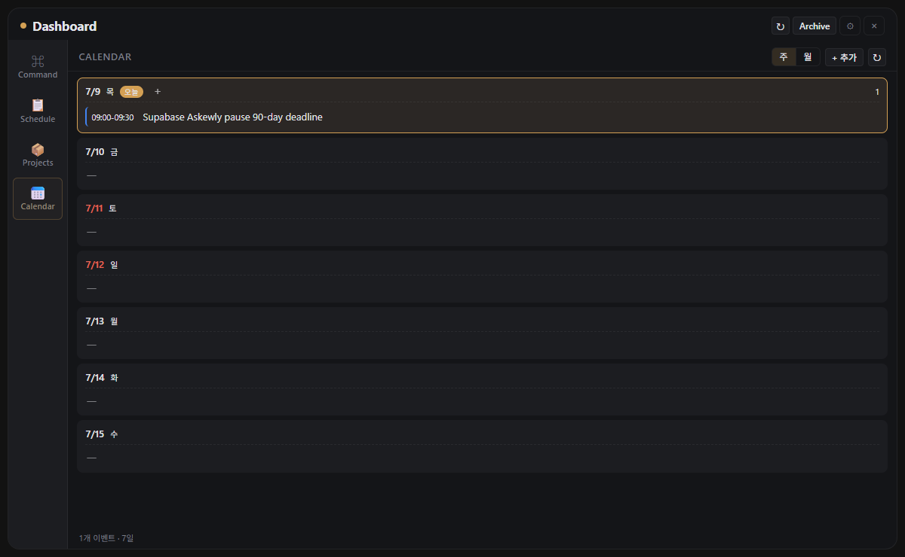

# Askewly Command

> 개인용 Google 생태계 기반 작업·일정 컨트롤러. 항상 떠 있는 Windows 위젯 + Expo 모바일 앱 + agent-facing CLI가 같은 Google Workspace 데이터(Tasks·Calendar·Sheets)를 읽고 쓴다.



## What it is

흩어진 일정과 할 일을 오늘 실행 가능한 상태로 붙잡아두는 개인 명령 센터다. 할 일은 Google Tasks, 시간 일정·마감은 Google Calendar, 프로젝트 카탈로그는 Google Sheets에 있고, PC 위젯·모바일 앱·`askewly` CLI 세 표면이 같은 데이터를 조작한다. 자체 백엔드는 없다 — Supabase 시대 코드는 2026-07-10 M74에서 완전 제거됐다(ADR 0008).

## Portfolio Snapshot

Askewly Command is an agent-native personal command center: a Windows desktop widget, an Expo mobile app, and a local `askewly` CLI all operate on the owner's Google Workspace data (Tasks, Calendar, Sheets). It is a personal product by design — no store release, no multi-user story.

- **Strongest signal**: Codex/Claude Code turn natural language into validated `askewly` CLI commands, so agent sessions update the same task/schedule/catalog data the widget and mobile app render — no direct database shortcuts.
- **Current boundary**: personal command center only; store distribution, team sharing, and billing are intentionally out of scope. Public surfaces exist as portfolio evidence.

## Architecture

```
┌──────────────────────┐  ┌──────────────────────┐  ┌──────────────────────┐
│ Windows widget       │  │ Expo mobile app      │  │ askewly CLI          │
│ (Electron, widget/)  │  │ (mobile-v2/)         │  │ (scripts/)           │
└──────────┬───────────┘  └──────────┬───────────┘  └──────────┬───────────┘
           │ Google OAuth            │ native Google OAuth     │ gws token cache
           └──────────────┬──────────┴──────────────┬──────────┘
                          ▼                         ▼
              Google Tasks · Google Calendar · Google Sheets
              (할 일)       (시간 일정·마감)     (프로젝트 카탈로그)
```

**세 클라이언트, 한 데이터 층**: 위젯·모바일·CLI가 전부 Google Workspace REST를 직접 호출한다. 마감(Deadline)은 Calendar 종일 이벤트로 관리하고, Askewly 전용 메타데이터(프로젝트 연결·상태)는 Google Tasks notes에 보존된다.

**Agent command surface**: `askewly` CLI는 Codex/Claude Code 세션이 자연어 요청을 명시 command payload로 바꿔 일정과 프로젝트를 조작하는 로컬 도구다. 직접 SQL·private API 대신 앱과 같은 계약을 사용한다.

## Surfaces

| 표면 | 구성 | 특징 |
|---|---|---|
| **Widget** (`widget/`) | 오늘 중심 단일 컬럼 + 달력 탭 + 프로젝트 레일 | 우측 세로 모니터 상시 표시, optimistic CRUD, 오프라인 fallback |
| **Mobile** (`mobile-v2/`) | 오늘/달력/백로그/프로젝트 탭 | 네이티브 Google 로그인, 위젯과 같은 데이터 왕복 |
| **CLI** (`scripts/askewly-command.js`) | tasks·projects 명령 | 에이전트가 검증된 payload로 조작 |
| **Landing** (`web/`) | dashboard.askewly.com | 정적 포트폴리오 페이지 (Cloudflare Worker) |

## Quick Start

```powershell
cd $env:USERPROFILE\projects\askewly-command
npm install
npm start
```

또는 콘솔 창 없이:

```powershell
wscript .\start_workspace_pulse.vbs
```

Windows 시작프로그램 등록:

```powershell
npm run install-startup
```

## Agent CLI

Install the global Windows shim:

```powershell
powershell -NoProfile -ExecutionPolicy Bypass -File .\scripts\install-askewly-cli.ps1
```

Use it from any shell:

```powershell
askewly projects list
askewly tasks add --title "교수님들 메일" --section today --project "Askewly Command"
askewly tasks add --title "마감 보고" --section deadlines --due "2026-06-25 18:00"
askewly tasks update --id TASKID --due "2026-06-26"
askewly tasks move --id TASKID --section backlog
askewly tasks status --id TASKID --status done
```

`--due` accepts `YYYY-MM-DD`, `YYYY-MM-DD HH:mm`, and ISO datetimes. Date-only values are treated as KST 23:59.

## Repo layout

```
askewly-command/
├── widget/                     # Electron widget v2 (main.js, renderer/, data-service)
├── mobile-v2/                  # Expo React Native app (Google-native rebuild)
├── web/                        # Vite React public landing → Cloudflare Worker assets
├── scripts/
│   ├── askewly-command.js      # Agent-facing CLI (Google Tasks/Calendar/Sheets)
│   ├── lib/google-workspace-*.js  # Google REST adapters
│   ├── install-askewly-cli.ps1 # Global Windows askewly shim
│   └── verify-*.js             # Contract/verification gates
├── docs/                       # ADRs, plans, milestone evidence
└── assets/widget-screenshot.png
```

## Deploy public landing

```powershell
npm run web:deploy
```

This builds `web/`, deploys `web/dist` as Cloudflare Worker static assets.

## See also

- [`ROADMAP.md`](ROADMAP.md) — 마일스톤·완료 이력
- [`CLAUDE.md`](CLAUDE.md) — 에이전트 작업 컨텍스트
- [`docs/adr/0008-legacy-supabase-decommission.md`](docs/adr/0008-legacy-supabase-decommission.md) — Supabase 시대 청산 기록
